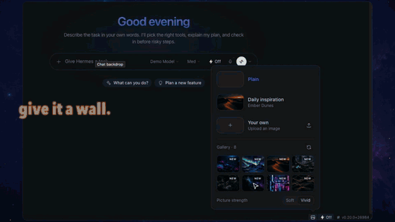
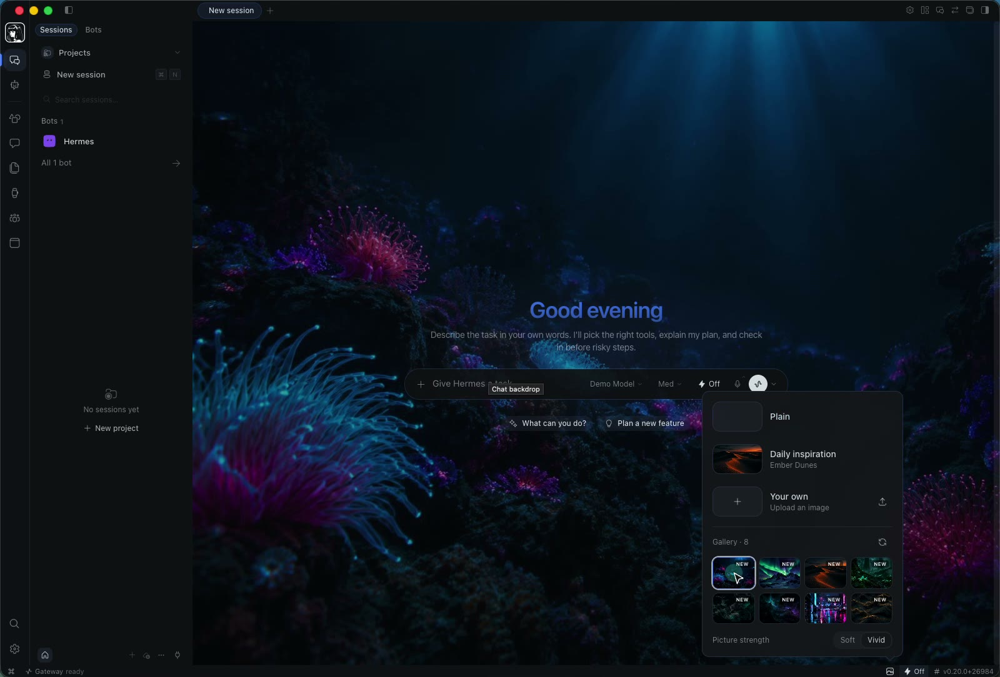
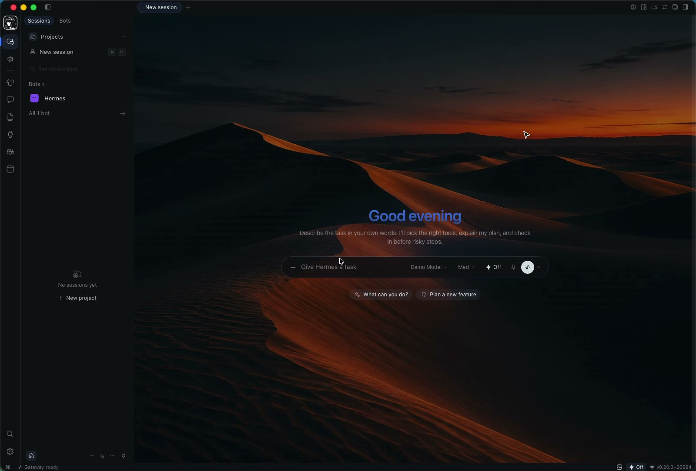
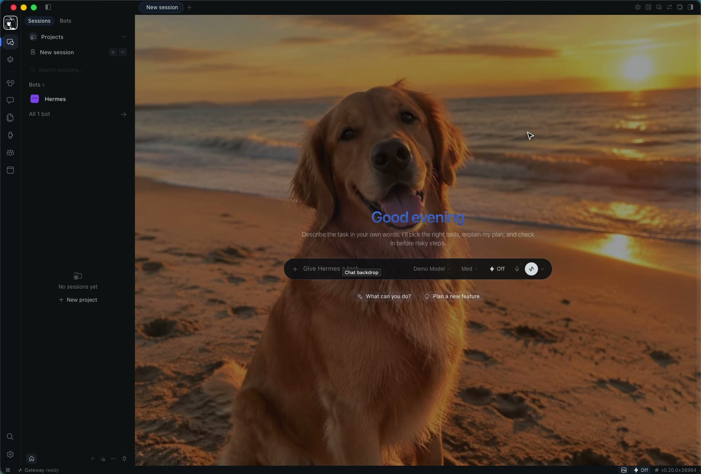
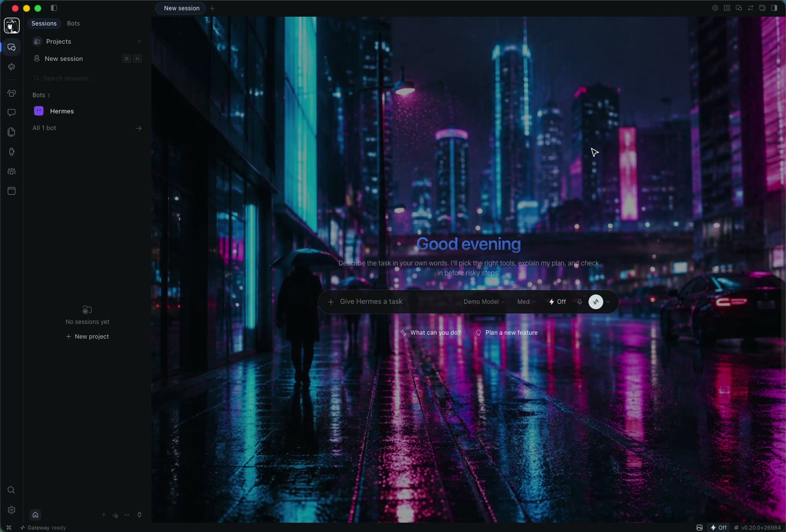
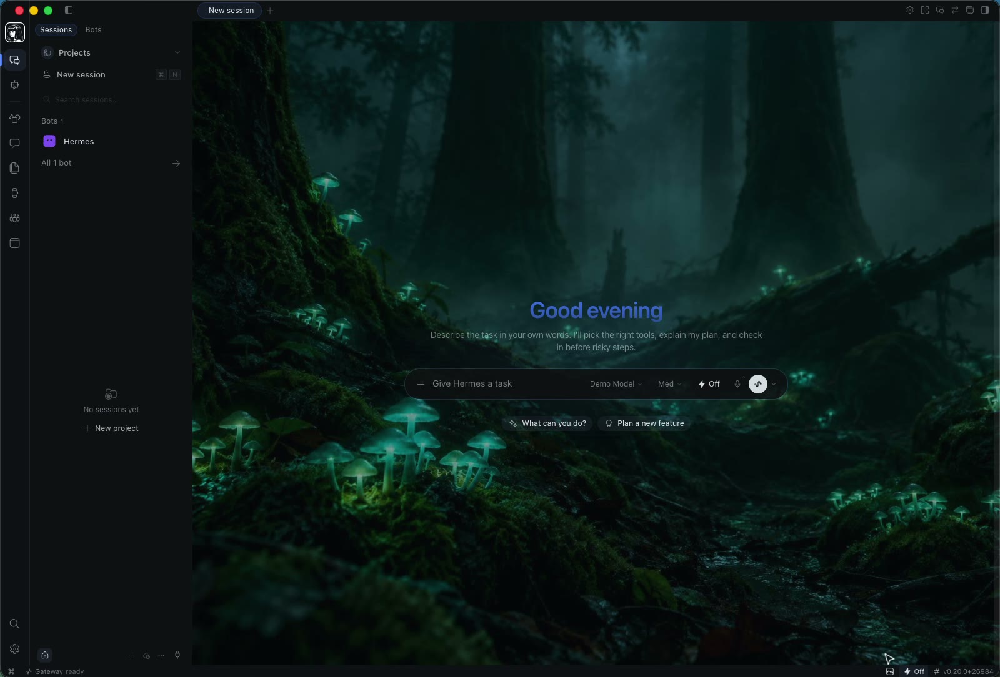
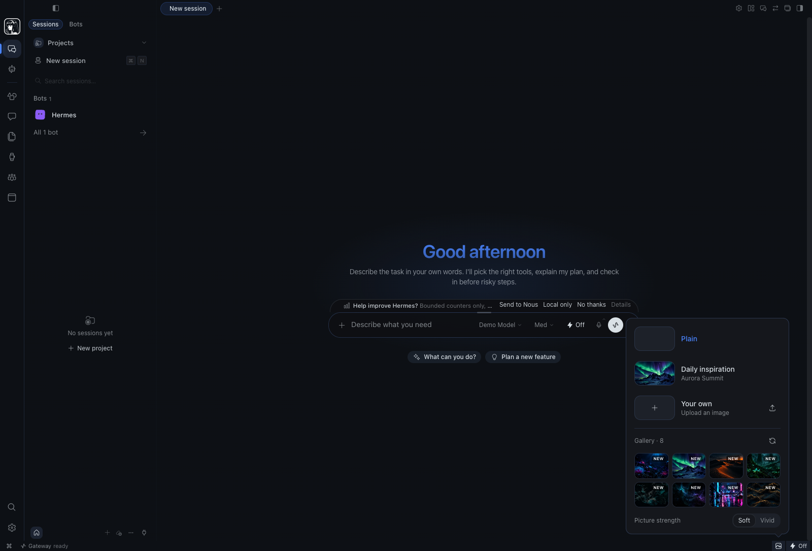

# Backdrops: a picture behind your Hermes chat

A Hermes Desktop plugin that puts a picture behind the chat **without changing
your theme**. Click the picture icon in the status bar and pick:

- **Plain**: the normal chat.
- **Daily inspiration**: a different gallery picture every day.
- **Your own**: upload any photo. It is downscaled and kept on your machine.
- **Gallery**: any drop from the gallery. New drops get a *New* badge for 30 days.

**Picture strength** switches between *Soft* (text stays very readable) and *Vivid*.
Your colours, fonts and light/dark mode are left alone, because the picture sits
under whatever theme you already use.



▶ [Watch the 30-second film (with sound)](docs/demo.mp4)

| Picker | Daily inspiration | Your own photo |
| --- | --- | --- |
|  |  |  |
| **Rainline City** | **Glowcap Forest** | **Light mode** |
|  |  |  |

## Install

Hermes Desktop → **Capabilities → Plugins → Install from Git**, paste

```
https://github.com/DECRUX9812/hermes-backdrops
```

then turn it on. Plugins are on by default; switch one off in the same page.

### By hand

The runtime only loads `<plugin-root>/<name>/plugin.js`. This repo keeps its
entry point in `desktop/plugin.js`, so a plain clone is **not** enough: copy
that file to the folder root as well:

```bash
git clone https://github.com/DECRUX9812/hermes-backdrops ~/.hermes/desktop-plugins/backdrops
cp ~/.hermes/desktop-plugins/backdrops/desktop/plugin.js \
   ~/.hermes/desktop-plugins/backdrops/plugin.js
```

Skipping the `cp` leaves the plugin invisible: it is not listed and produces no
error. (Install-from-Git does this copy for you; it is only the manual path
that needs it.)

The plugin fetches its pictures from `backdrops.json` over HTTPS, so a manual
install only needs `plugin.js`. The `backgrounds/` folder is the bundled
fallback and the docs are for the website; neither is required to run.

## New pictures without updates

The gallery is the data file [`backdrops.json`](backdrops.json). The plugin reads it
on start and every 6 hours. You can also refresh it by hand. Adding a picture
means adding a file under `backgrounds/` and an entry to the JSON. **No plugin
code is ever downloaded.**

```json
{ "id": "my-drop", "title": "My Drop", "url": "backgrounds/my-drop.jpg", "thumb": "backgrounds/thumbs/my-drop.jpg", "added": "2026-10-03" }
```

Relative paths resolve against the manifest URL. Remote entries are
shape-checked, and only `http(s)` images are accepted. If the manifest can't be
reached, the last good gallery is used, then the list built into the plugin.
Your own photo always works offline.

## How it works

- `desktop/plugin.js` is plain ESM. It imports only `@hermes/plugin-sdk`, `react` and `react/jsx-runtime`.
- It adds one status-bar item (`STATUSBAR_AREAS.right`) with a popover.
- It paints through one React-rendered stylesheet on the documented
  `[data-chat-surface]` hook. Inside it, the chat surface token goes
  transparent, the same way the app's glass mode does.
- It never queries or edits app markup and touches no internal stores. Turn the
  plugin off and the stylesheet unmounts, leaving the app exactly as it was.
- Choice, photo, strength and gallery cache live in plugin storage (`ctx.storage`).

`hermes plugins validate .` passes, including the *desktop surface* check.

MIT © Ritesh Patel (DECRUX9812)
